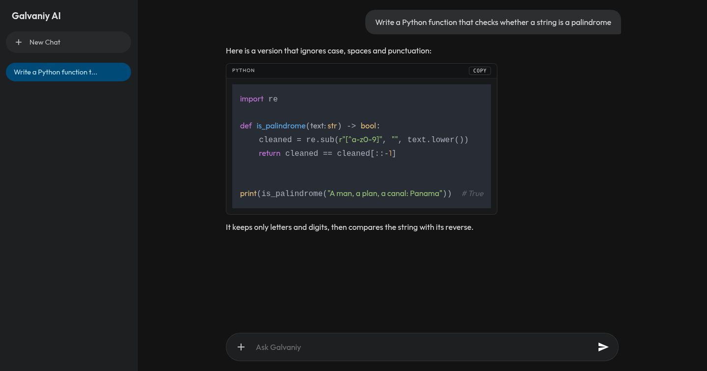
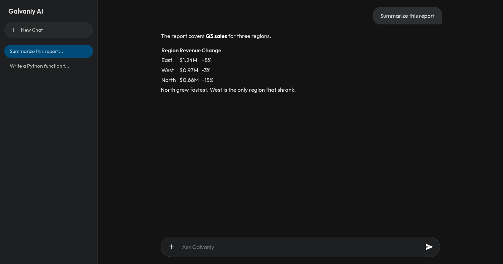
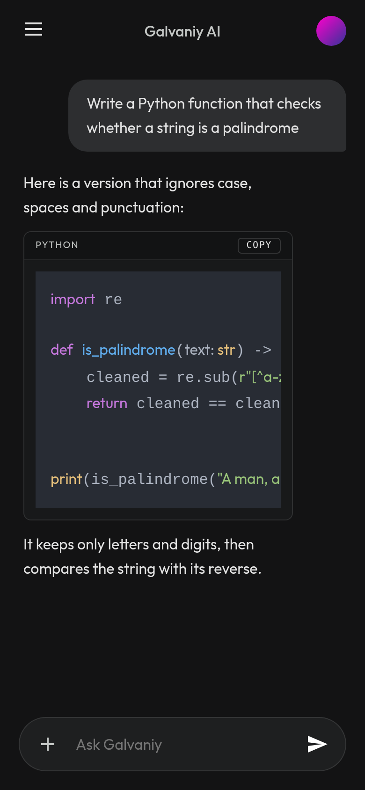
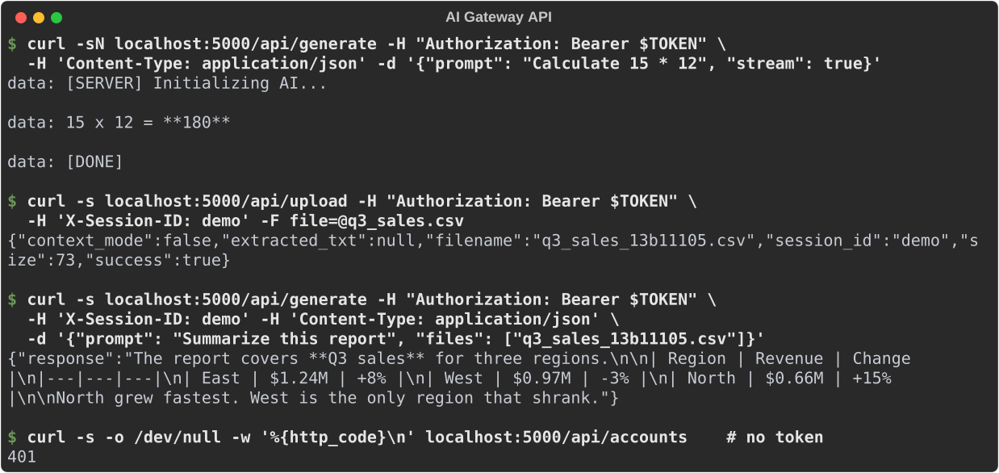

# AI Gateway

An HTTP API and web chat that forward prompts to the AI coding CLIs installed on a machine: Google Antigravity (`agy`), Claude Code (`claude`) and GitHub Copilot (`copilot`). Send a prompt, optionally with uploaded files, and get the answer back as JSON or as a live stream. The gateway handles the CLI processes, per-session file folders, PDF text extraction, and switching between several `agy` accounts when one runs out of quota.



## Contents

- [What it does](#what-it-does)
- [Install](#install)
- [Running it](#running-it)
- [Web chat](#web-chat)
- [Access tokens](#access-tokens)
- [API reference](#api-reference)
- [Files and sessions](#files-and-sessions)
- [Multiple agy accounts](#multiple-agy-accounts)
- [Model failover](#model-failover)
- [Configuration](#configuration)
- [Security notes](#security-notes)
- [Limitations](#limitations)
- [Troubleshooting](#troubleshooting)
- [Development](#development)

## What it does

```text
 browser / app / script
          │  POST /api/generate {prompt, files, backend, stream}
          ▼
 ┌──────────────────────────┐   runs one CLI process per request, in the session's upload folder
 │  AI Gateway (Flask)      │──▶ agy -p … --output-format stream-json --sandbox
 │  token check, uploads,   │──▶ claude -p … --output-format stream-json
 │  SSE streaming           │──▶ copilot -p … --output-format json
 └──────────────────────────┘
          │  JSON answer, or text/event-stream chunks ending in [DONE]
          ▼
```

- **One API for three CLIs.** Pick `agy` (the default), `claude` or `copilot` per request.
- **Streaming.** Answers can arrive as Server-Sent Events. When the client disconnects, the gateway stops the CLI process.
- **Files.** Upload text, PDFs or images; the agent reads them. PDFs are converted to text automatically.
- **Sessions.** Each session gets its own upload folder, so users don't see each other's files.
- **Generated images.** Images that `agy` creates are copied into the session and linked in the answer.
- **Quota failover.** Several `agy` Google accounts can share the load. An account that hits its limit rests until its quota resets (at most 30 minutes), and you can see each account's remaining quota.
- **Model failover.** When the primary Gemini model has no capacity, `agy` requests switch to a fallback model for a few minutes.
- **Web chat.** A chat page at `/` with history, file attachments and code highlighting, which also works on phones.

## Install

You need:

- Linux (the gateway uses `pty` and `fcntl`, and the installer sets up a systemd user service)
- Python 3 with `venv`
- At least one of `agy`, `claude` or `copilot`, installed and logged in for the user that runs the gateway

```bash
git clone https://github.com/mr-ceo7/AI_gateway.git ~/AI_gateway
cd ~/AI_gateway
./install.sh
```

The installer:

1. creates `venv/` and installs `requirements.txt`
2. copies `.env.example` to `.env` (if there's no `.env` yet), puts a random access token in `GATEWAY_TOKENS`, and makes the file readable only by you
3. adds an `ai-gateway` command to `~/.local/bin`
4. writes a systemd user service, `~/.config/systemd/user/ai-gateway.service`

Clone into `~/AI_gateway`: the `ai-gateway` command looks for the code there.

To remove the command and service later, run `./uninstall.sh`. It leaves the folder and `.env` in place.

## Running it

```bash
systemctl --user start ai-gateway      # in the background
systemctl --user enable ai-gateway     # start at login / boot
journalctl --user -u ai-gateway -f     # follow the log
ai-gateway                             # or in the foreground
```

All of these serve on port 5000. Check that it's up:

```bash
curl http://localhost:5000/api/auth/status
# {"authenticated":true,"has_url":false}
```

`python app.py` starts Flask's development server on port 5055 instead (or `PORT`). That's useful for debugging; use gunicorn (above) otherwise.

If `agy` isn't logged in when the gateway starts, the gateway starts the `agy` login in the background, and the web chat shows a sign-in dialog. Open the Google link, sign in, and paste the code back. The endpoints behind that dialog are listed under [API reference](#api-reference).

## Web chat

Open `http://<server>:5000/`. The first time, the page asks for the access token (see below) and remembers it in that browser. Conversations are also stored in the browser, not on the server.

| Ask about an attached file | Phone layout |
|---|---|
|  |  |

- **Attach files** with `+`. They go to your session folder and are referenced in your next message.
- **Stop** an answer with the button that replaces Send. That ends the CLI process on the server.
- **Start over** with **New Chat**. Earlier chats stay listed in the sidebar.

## Access tokens

When `GATEWAY_TOKENS` is set (the installer sets one), every `/api/` request except `GET /api/auth/status` needs one of its tokens. Send it in any of these:

```http
Authorization: Bearer <token>
X-Gateway-Token: <token>
GET /api/artifacts/demo/chart.png?token=<token>
```

The query-string form exists for `` tags showing generated images, which can't send headers. Prefer the headers elsewhere: URLs end up in logs and browser history.

Find your token with `grep GATEWAY_TOKENS ~/AI_gateway/.env`. Several comma-separated tokens can be active at once, so you can give each client its own and revoke one by removing it. Restart the gateway after editing `.env`.

If `GATEWAY_TOKENS` is empty, the API is open to anyone who can reach the port, and the gateway prints a warning at startup.

## API reference



| Method and path | Purpose |
|---|---|
| `GET /` | Web chat |
| `POST /api/generate` | Ask a question |
| `POST /api/upload` | Upload a file to a session |
| `GET /api/artifacts/<session>` | List images in a session |
| `GET /api/artifacts/<session>/<file>` | Download one |
| `GET /api/accounts` | `agy` account pool status |
| `GET /api/accounts/quotas` | Pool status plus each account's remaining 5-hour and weekly quota, and the model status. `?refresh=1` skips the 60-second cache |
| `GET /api/model/status` | Which model `agy` requests use now, and failover history |
| `POST /api/model/reset-cooldown` | Go back to the primary model immediately |
| `GET /api/auth/status` | Health check and `agy` login state. No token needed |
| `GET /api/auth/url` | The Google sign-in link while an `agy` login is waiting (404 otherwise) |
| `POST /api/auth/submit` | `{"code": "…"}` — finish that login |
| `POST /api/auth/terminate` | Stop the login process and recheck credentials |

More examples in shell, Python and JavaScript: [docs/client-examples.md](docs/client-examples.md).

### POST /api/generate

```bash
curl -s http://localhost:5000/api/generate \
  -H "Authorization: Bearer $TOKEN" -H "Content-Type: application/json" \
  -d '{"prompt": "Calculate 15 * 12"}'
# {"response": "15 x 12 = **180**"}
```

| Field | Type | Meaning |
|---|---|---|
| `prompt` | string | The question. Use this or `messages` |
| `messages` | array | Conversation as `[{"role": "user" \| "model", "content": "…"}]`. It's flattened into one prompt (`User: …` / `Model: …` lines), because the CLIs start fresh each request |
| `files` | array | Names returned by `/api/upload` in this session, as strings or `{"filename": …}`. Unknown names are skipped |
| `backend` | string | `agy` (default, or `DEFAULT_BACKEND`), `claude`, `claude2`, `copilot`. `claude` runs the `claude2` command instead when one is installed |
| `stream` | bool | `true` for Server-Sent Events, default `false` |
| `model` | string | Model for this request, instead of the automatic primary/fallback choice. **agy only** |
| `effort` | string | `low`, `medium`, `high`, `max`. **agy only** |
| `json_schema` | object | JSON Schema the final answer must follow. Turns streaming off. **agy only** |
| `session_id` | string | Session, if you don't send the `X-Session-ID` header. Default `default` |

**Without streaming** the reply is `{"response": "…"}`. Errors:

| Status | Body | When |
|---|---|---|
| 400 | `{"error": …}` | Missing prompt, or a bad `effort` / `json_schema` |
| 401 | `{"error": "Missing or wrong gateway token"}` | Token missing or wrong |
| 500 | `{"error": "AI CLI failed", "stderr": …, "returncode": …}` | The CLI exited with an error |
| 502 | `{"error": "No answer from the AI …"}` | The CLI finished without an answer, for example because it tried an action it isn't allowed |
| 504 | `{"error": "Request timeout …"}` | No answer within 300 seconds. Use streaming for long jobs |

**With streaming** the reply is `text/event-stream`:

```text
data: [SERVER] Initializing AI...

data: 15 x 12 = **180**

data: [DONE]
```

- The first event is always `[SERVER] Initializing AI...`.
- Answer text follows in as many events as the CLI produces. Text containing line breaks spans several `data:` lines in one event; join them with `\n`, as `EventSource` does.
- Problems arrive as `[ERROR] <message>`.
- The stream ends with `[DONE]`.
- Images that `agy` generated are appended as Markdown, ``.

### POST /api/upload

Multipart form with a `file` field (plus optional `session_id` and `context_mode` fields), or JSON `{"filename": "…", "file": "<base64>"}`. The session comes from the `X-Session-ID` header or the `session_id` form field.

```json
{"success": true, "filename": "q3_sales_13b11105.csv", "extracted_txt": null,
 "size": 73, "context_mode": false, "session_id": "demo"}
```

`filename` is what you pass in `files`. For PDFs, `extracted_txt` is the text copy's name. `context_mode` is accepted and echoed back, but it doesn't change anything at the moment.

### GET /api/accounts

```json
{"total": 2, "active_account": "primary",
 "accounts": [{"id": "primary", "email": "you@example.com", "status": "ready", "cooldown_until": null,
               "success_count": 42, "fail_count": 1, "last_used_at": "2026-10-02T01:00:00+00:00", "home_dir": "…"}]}
```

## Files and sessions

- **Where uploads go.** Uploads land in `~/.gemini_uploads/<session>/` as `<name>_<8 hex digits of the MD5>.<ext>`. The session name is reduced to letters, digits, `_` and `-` (at most 64 characters).
- **Where the CLI runs.** Each request runs the CLI inside its session folder. When you pass `files`, the gateway puts a preamble in front of your prompt that lists the files' full paths and tells the agent to read them, not change them, and not run commands.
- **PDFs.** PDFs are converted with PyPDF2 into a `.txt` next to the original. When you reference the PDF, the agent is pointed at the text copy.
- **File types.** Any file type is accepted and stored. Text, PDFs and images (PNG, JPEG, WebP, GIF) are what the agents can actually read.
- **Clean-up.** Files older than `UPLOAD_TTL_SECONDS` (default 6 hours) are deleted whenever any upload happens, along with session folders that have become empty.

## Multiple agy accounts

For `agy` requests, the gateway picks an account from a pool in `~/.gemini_accounts` (or `AGY_ACCOUNTS_DIR`). If the pool is empty, `agy` runs with your normal login. When a request fails with a quota error (`429`, `RESOURCE_EXHAUSTED`, "quota exceeded", "quota reached", "individual quota", "upgrade your subscription", "rate limit"…), that account rests and the pool moves to the next one.

The rest period comes from the error itself ("resets in 12m" gives 12 minutes and 30 seconds). It is capped at 30 minutes, and is 30 minutes when the error doesn't say. A long reset time, such as "45 hours", usually means a billing cycle, so it gets the 30-minute cap too.

- **Without streaming,** the request is retried once, straight away, on the next account.
- **With streaming,** the client gets the `[ERROR]`, and the next request uses the next account.

Manage the pool with `manage_accounts.py`:

```bash
python manage_accounts.py list                  # accounts, active one, cooldowns
python manage_accounts.py import-current main   # add the account agy is logged into now
python manage_accounts.py import-keyring main   # add the agy token stored in the desktop keyring
python manage_accounts.py add backup            # log in to another Google account
python manage_accounts.py test [name]           # send a test prompt with each account
python manage_accounts.py remove backup
python manage_accounts.py sync-to-prod          # see below
```

`GET /api/accounts/quotas` shows how much quota each account has left. It runs `agy -p /usage` with every account, in parallel, and caches the result for 60 seconds:

```json
{"total": 1, "active_account": "acct1", "cached": false, "cache_age_seconds": 0,
 "accounts": [{"id": "acct1", "is_active": true, "...": "...",
               "quotas": {"five_hour": {"remaining_pct": 73, "used_pct": 27, "reset_at": "resets in 2h"},
                          "weekly":    {"remaining_pct": 40, "used_pct": 60, "reset_at": "resets Mon"}}}],
 "model_status": {"active_model": "gemini-3.8-flash-high", "...": "..."}}
```

The pool format is the same one [agy-pool](https://github.com/mr-ceo7/agy-pool) uses, so accounts added with either tool work in both.

`sync-to-prod` copies the gateway code to `/var/www/ai-gateway` on `PROD_HOST`, and the account pool to `/root/.gemini_accounts`. It then restarts `ai-gateway.service` there and prints `/api/accounts` from it. It uses `PROD_HOST`, `PROD_USER` and `PROD_PASS` (via `sshpass`, or your SSH key if `PROD_PASS` is empty), and `PROD_GATEWAY_TOKEN` for the API call. It connects with host-key checking turned off.

## Model failover

`agy` requests run with `--model`. Normally that's `DEFAULT_MODEL`. When the model reports no capacity, the gateway switches to `FALLBACK_MODEL` for `MODEL_COOLDOWN_SECONDS` (default 5 minutes). The errors that count are a 503, "no capacity available", "overloaded", "deadline exceeded" and "stream was interrupted". After the cooldown it tries the primary model again, and any success on the primary clears the cooldown.

- **Without streaming,** the failed request is retried at once on the fallback model.
- **With streaming,** the client gets the `[ERROR]` and the following requests use the fallback.
- **A request that sets `model`** always uses that model, and doesn't affect the failover state.

```bash
curl -s localhost:5000/api/model/status -H "Authorization: Bearer $TOKEN"
```

```json
{"active_model": "gemini-3.7-flash-high", "primary_model": "gemini-3.8-flash-high",
 "fallback_model": "gemini-3.7-flash-high", "in_failover": true, "cooldown_seconds_remaining": 214,
 "last_failover_at": "2026-10-09T15:41:48+00:00", "last_error": "API error (attempt 2): UNAVAILABLE (code 503): …",
 "failover_count": 1, "stats": {"requests_primary": 2, "requests_fallback": 1}}
```

`POST /api/model/reset-cooldown` switches back to the primary model straight away. The counters are kept in memory per gunicorn worker, so with several workers each one tracks its own failover state.

## Configuration

Set these in `.env` (or the environment) and restart the gateway.

| Variable | Default | Meaning |
|---|---|---|
| `GATEWAY_TOKENS` | empty (open) | Comma-separated access tokens |
| `DEFAULT_BACKEND` | `agy` | CLI used when a request has no `backend` |
| `CORS_ORIGINS` | `*` | Websites allowed to call the API from a browser, comma-separated |
| `UPLOAD_TTL_SECONDS` | `21600` | Age at which uploaded files are deleted |
| `PORT` | `5000` | Port for `ai-gateway` / `start.sh`. `python app.py` defaults to 5055. The systemd service is fixed to 5000; edit `ExecStart` in its unit file to change it |
| `HOST` | `0.0.0.0` | Bind address for `ai-gateway` / `start.sh` |
| `DEFAULT_MODEL` | `gemini-3.8-flash-high` | Model `agy` requests use normally |
| `FALLBACK_MODEL` | `gemini-3.7-flash-high` | Model used while the primary has no capacity |
| `MODEL_COOLDOWN_SECONDS` | `300` | How long to stay on the fallback model |
| `AGY_ACCOUNTS_DIR` | `~/.gemini_accounts` | Location of the account pool |
| `PROD_HOST`, `PROD_USER`, `PROD_PASS`, `PROD_GATEWAY_TOKEN` | | Only for `sync-to-prod` |

`config.py` lists more settings (rate limits, file size limits and others). Those belong to a planned refactor and aren't used yet; see [docs/plans](docs/plans/README.md).

## Security notes

- **Who can reach it.** The gateway runs AI agents with your logins, on your machine, in your name. Keep `GATEWAY_TOKENS` set, and don't expose port 5000 to the internet without TLS in front (for example nginx or Caddy).
- **Where the token is kept.** The web chat stores the token in the browser's `localStorage`. Anyone with access to that browser profile can read it.
- **What the agent may do.** Only `agy` runs with `--sandbox --disable-slash-commands`. `claude` and `copilot` run with their own default permissions. Every agent is told to only read files, but that instruction is part of the prompt, not an enforced limit.
- **Uploads.** There's no limit on upload size or file type. Uploads are readable by any agent request in the same session.
- **The health check.** `/api/auth/status` is open, and reveals whether `agy` is logged in.

## Limitations

- **One request at a time.** The service runs gunicorn with one synchronous worker and no timeout, so a long or streaming request holds up the next one. `gevent` is installed, but it isn't enabled or tested.
- **No conversation memory.** Each request starts a fresh CLI. Multi-turn chat works by resending the history in `messages`.
- **`model`, `effort` and `json_schema`** only reach `agy`.
- **The Dockerfile is out of date.** It installs `@google/gemini-cli`, not `agy`, and `start.sh` still warns about `GEMINI_API_KEY`. Neither is needed for the systemd setup.

## Troubleshooting

| Problem | Fix |
|---|---|
| `401 Missing or wrong gateway token` | Send a token from `GATEWAY_TOKENS`. The web chat asks again whenever it gets a 401 |
| `{"authenticated": false}` / sign-in dialog keeps appearing | Run `agy` once as the gateway's user and log in, or finish the dialog's Google sign-in |
| `500 AI CLI failed` | Read `stderr` in the response. Often the CLI isn't installed, isn't on the service's `PATH`, or isn't logged in |
| `502 No answer from the AI (it tried actions that are not allowed …)` | The agent attempted something its sandbox forbids. Rephrase, or use a different `backend` |
| Streams arrive all at once behind nginx | The gateway sends `X-Accel-Buffering: no`; also make sure `proxy_buffering off` is set |
| Other requests hang during a long answer | See [Limitations](#limitations): there's one worker |
| `ai-gateway: …/start.sh: No such file` | The code isn't in `~/AI_gateway`. Move it there, or edit `~/.local/bin/ai-gateway` |

`python test_credentials.py` shows which credential files the gateway's login check finds.

## Development

```bash
python -m venv venv && . venv/bin/activate
pip install -r requirements.txt
python app.py                                  # development server on :5055
pip install websocket-client rich
python scripts/screenshots.py                  # regenerate docs/ screenshots
```

`scripts/screenshots.py` runs a copy of the gateway in a temporary home with a stand-in `agy`, so it needs no account and uses no quota. It drives the web chat in headless Chrome and records real `curl` calls.

| Path | Contents |
|---|---|
| `app.py` | Routes, token check, CLI processes, streaming, uploads, `agy` login flow |
| `utils/account_pool.py` | `agy` account pool and quota detection |
| `manage_accounts.py` | Command line for the pool and `sync-to-prod` |
| `templates/index.html` | The web chat |
| `install.sh`, `uninstall.sh`, `start.sh`, `ai-gateway.service` | Setup and service |
| `test_credentials.py` | Shows which credential files the login check sees |
| `docs/client-examples.md` | Client code in shell, Python and JavaScript |
| `docs/plans/` | Unimplemented hardening plan; `config.py` and the rest of `utils/` belong to it |

## License

MIT. See [LICENSE](LICENSE).
